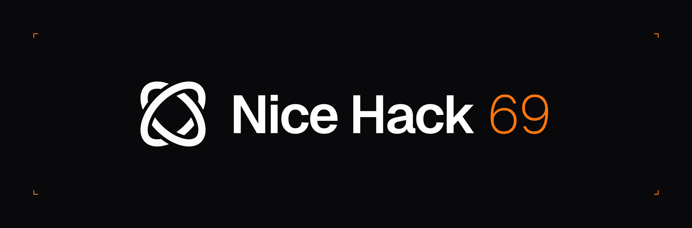

# 🚀 #nicehack69 – The Browser-Use Hackathon

We just hit **69,000 GitHub ⭐. Nice.**  
To celebrate, we’re launching **#nicehack69** — a Twitter-first hackathon with a $6,900 prize pool.

This is your chance to **dream big** and show us the future of browser-use agents:  
Agents that can actually **do stuff online, solve real tasks, and go beyond bullshit demos**.

---

## 🏆 Prizes

All engraved `69k ★ | Nice`:

- **Grand Prize:** MacBook Pro 14" M4 Pro
- **$690:** Nicest Demo Hack
- **$420:** Most Bugs Found in Browser-Use
- **AirPods Pro:** Nicest Impressions on X Hack

💰 **Total prize pool: $6,900**

---

## 📅 Deadline

Submissions close when **Browser-Use GitHub hits 69,420 ⭐**  
(or Monday, September 8th at 9AM PST, whichever comes first).

---

## 📜 Rules

This is a **Twitter-first hackathon**:

1. **Announce participation** → Requote the kickoff tweet with **#nicehack69**
2. **Get building** → DM [@browser_use](https://twitter.com/browser_use) to receive free Browser-Use Cloud credits
3. **Final submission** must include:
   - A **DEMO video** (posted on Twitter/X with hashtag `#nicehack69`)
   - A **GitHub repo** with a **standalone README** (make it look like a real project — see [Browser-Use README](https://github.com/browser-use/browser-use) for inspiration)
4. **Final step**: open a GitHub issue in this repo with:
   - Link to your Twitter demo post
   - Link to your GitHub repo

---

## 🎯 Criteria

- **Dream big**: build what the future of Browser-Use agents should look like
- Use **Browser-Use or Browser-Use Cloud** as a **core part of your stack** (you can integrate any other tools too)
- No “bullshit hacks”: if your use case can be solved by calling `chatgpt` directly, that’s not a real Browser-Use agent
- Submissions should feel like a real project: fullstack apps, no-stack workflows, ML algorithms, creative integrations
- Complain loudly about our SDKs: **report every bug, every bad UX** — that feedback is gold

---

## 🔑 Resources

- [Browser-Use on GitHub](https://github.com/browser-use/browser-use)
- [Browser-Use Cloud](https://cloud.browser-use.com)

---

## 🙌 Join Us

This is your chance to push Browser-Use to its limits.  
We want hacks that make us say **“WTF did I just see?”** — and that point to what AI agents will actually look like in the future.

Good luck, and stay **nice** ✨
